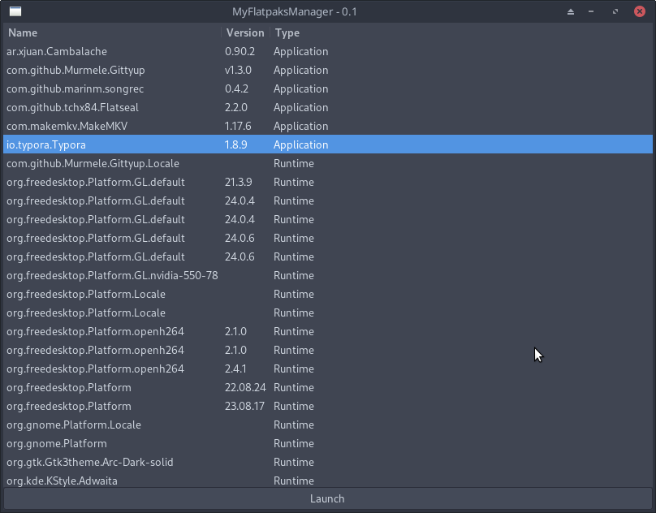

# MyFlatpaksManager

A simple, lightweight graphical manager for Flatpaks packages. Written in Python, using GTK & libflatpak.

## Dependencies

- python3
- gtk3
- libflatpak
- python3-xapps

## Works

- List installed Flatpaks ()
- Launching an app from the list

## To be added

- Allow user to list avaibles remote Flatpaks
  - Allow user to install a Flatpas from this list
- Allow user to remove an installed Flatpaks
- Allow user to list avaibles updates for installed Flatpaks
  - Allow user to update one or all Flatpak from this list
- Add a utilities tab
  - Check if Flapak support is enabled
  - Check if flathub remote repo is present of not
    - If not, the user can add this repo with a single button click
  - Add a button to install Flatseal for easily manager permitions.